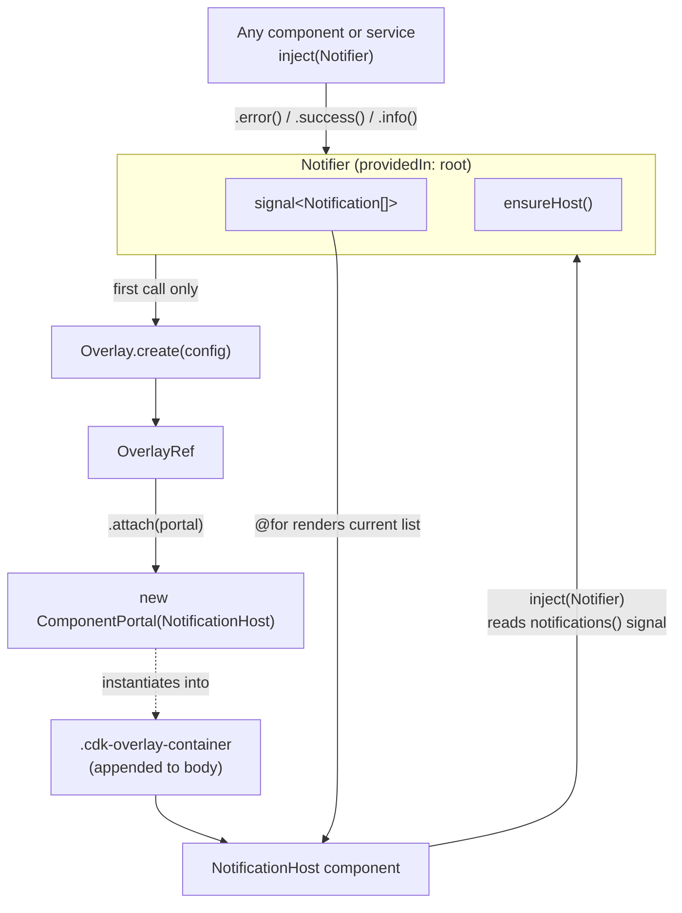
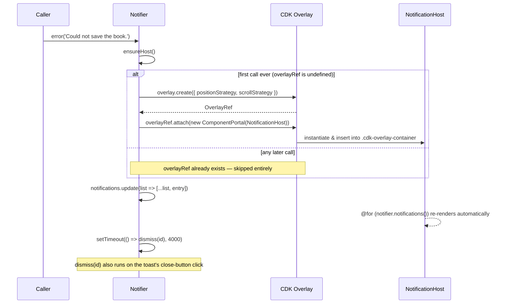

# Notifier & NotificationHost

Toast notifications for the workshop app. Deliberately built with the
Angular CDK's **Overlay** and **Portal** primitives instead of a plain
component you drop into a template.

## TL;DR — using it

You never touch `NotificationHost` or the CDK directly. Inject `Notifier`
and call a method:

```ts
private notifier = inject(Notifier);

save() {
  this.bookService.save(this.book).subscribe({
    next: () => this.notifier.success('Book saved.'),
    error: () => this.notifier.error('Could not save the book.')
  });
}
```

That's it — no `<app-notification-host>` tag anywhere, no module import
besides `Notifier`. The toast simply appears bottom-right and disappears
after 4 seconds (or on click of its close button).

This document explains **how** that "just works", because the
implementation in [`notifier.ts`](./notifier.ts) leans on two CDK concepts
(`Portal` and `Overlay`) that are genuinely useful to understand — they're
the same building blocks Angular Material's own dialogs, menus, tooltips
and snackbars are built on.

## Why not just a component in `app.html`?

The straightforward version of this feature would add
`<app-notification-host />` next to `<app-sidebar>` in `app.html`. That
works, but it means:

- everyone has to know that tag exists and must not be removed
- the toast stack becomes "just another child" in the component tree, at
  the mercy of the app shell's CSS (`overflow`, `transform`, `z-index`
  from a parent — any of these can silently break a `position: fixed`
  child)

Instead, `Notifier` creates its own rendering surface **on demand**, fully
decoupled from `app.html`. That's exactly the problem the CDK's `Overlay`
and `Portal` APIs solve.

## Core concepts

### Portal (`@angular/cdk/portal`)

A **Portal** is "content that doesn't render where it's declared". Instead
of writing `<app-notification-host />` in a template (fixed location,
fixed lifetime tied to its parent), you wrap a description of *what* to
render in a `Portal` object and hand it to something else that decides
*where* to render it.

`ComponentPortal<T>` is the concrete portal type used here — it wraps an
Angular component class (`NotificationHost`) so it can be instantiated and
inserted into the DOM completely programmatically, with no template
reference to it anywhere in the app.

📖 [CDK Portal overview](https://material.angular.dev/cdk/portal/overview)

### Overlay (`@angular/cdk/overlay`)

An **Overlay** is the "stage" a portal gets projected onto: a dedicated
DOM container (`.cdk-overlay-container`) that Angular CDK appends directly
to `<body>` the first time it's needed, with a high `z-index` and no
relation to the app's own component tree. That's what makes it immune to
a parent's `overflow: hidden` or stray `z-index` — the exact fragility a
plain `position: fixed` child in `app.html` would have.

- `Overlay.create(config)` creates an `OverlayRef` — a handle to one such
  stage — configured with:
  - a **position strategy**: here, `.position().global().bottom('16px').right('16px')`,
    meaning "always pin this to the bottom-right of the viewport"
    (as opposed to *connected* position strategies, which anchor an
    overlay to another element — e.g. a dropdown anchored to its trigger
    button; toasts don't need that, they always render in the same corner)
  - a **scroll strategy**: here, `scrollStrategies.noop()`, meaning
    "do nothing special on scroll" (no repositioning, no auto-close —
    appropriate because the toast stack isn't anchored to any scrollable
    content)
- `overlayRef.attach(portal)` is the step that actually renders the
  portal's component into that stage.

📖 [CDK Overlay overview](https://material.angular.dev/cdk/overlay/overview)

## Architecture



The important part: `Notifier` and `NotificationHost` both depend on each
other — `Notifier` knows the `NotificationHost` *class* (to build the
portal), and `NotificationHost` injects `Notifier` (to read its signal and
call `dismiss()`). Neither one lives in `app.html`; the overlay container
is the only thing standing between them and `<body>`.

## Sequence: first call vs. later calls



`ensureHost()` is idempotent — it only creates the overlay and attaches
`NotificationHost` **once**, on whichever call happens to come first. Every
call after that just pushes a new entry into the signal; the already-live
`NotificationHost` re-renders on its own because `@for` tracks the signal.

## Why `@Service()` instead of `@Injectable({ providedIn: 'root' })`?

Angular 22 introduced `@Service()` as a shorthand for exactly that —
`@Injectable({ providedIn: 'root' })`. Both compile to the same thing; this
file uses the newer, shorter form.

## Further reading

- [CDK Overlay overview](https://material.angular.dev/cdk/overlay/overview)
- [CDK Portal overview](https://material.angular.dev/cdk/portal/overview)
